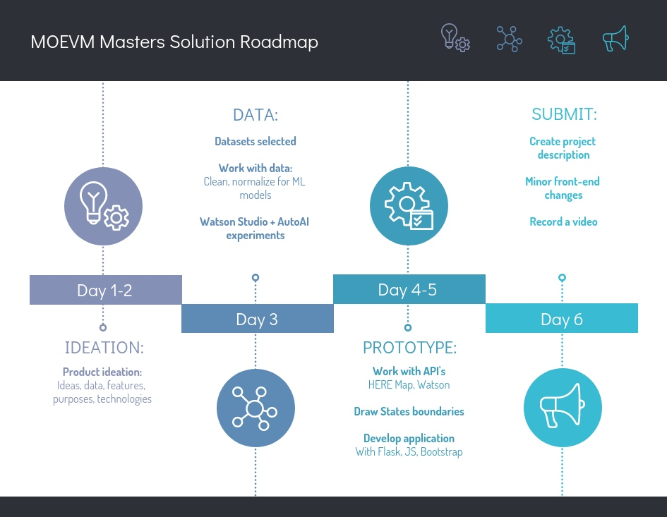

# Submission from team MOEVM Masters

We made an application to determine the feasibility of switching to green energy sources in specific states. 
The application is based on data from the US Energy Information Administration [[link]](https://www.eia.gov/state/maps.php)


## Contents

1. [Short description](#short-description)
2. [Demo video](#demo-video)
3. [Project roadmap](#project-roadmap)
4. [Getting started](#getting-started)
5. [Built with](#built-with)
6. [Authors](#authors)

## Short description

### What's the problem?

The traditional sources of electricity (coal, oil, gas) are being replaced by more environmentally friendly ones. This transition requires certain financial expenses, but now not all countries and regions are aware of the scale of the problem. We believe that the key problem is the lack of desire to change the existing order of things due to the inability to see the need for these changes.

### How can we help?

We offer a tool that will help analytical departments in many government agencies and private companies see the need for a transition to solar and wind energy, as well as baseline assess the feasibility of such a transition.

### The idea

With fairly complete statistics on the US energy sector, we have developed a kind of recommendation system that allows us to assess the possibility and feasibility of increasing the share of renewable energy sources in the state based on weather observations.

## Demo video

[](https://youtu.be/vOgCOoy_Bx0)

## Project roadmap



## Getting started

These instructions will get you a copy of the project up and running on your local machine for development and testing purposes. See deployment for notes on how to deploy the project on a live system.

### Prerequisites

Set up IBM Cloud (Watson) and HERE Map API keys as an enviroment variable:  

```bash
export HERE_API_KEY='\<api key\>'  
export WATSON_API_KEY='\<api key\>'
```

### Installing && run

Set up required python libraries:  

```bash
pip install -r requirements.txt
```

In project main directory run:
```bash
python ./app/app.py
```
And open localhost:8080 in your browser.


## Built with

* [Watson Knowledge Catalog](https://www.ibm.com/cloud/watson-knowledge-catalog)
* [Watson ML and Watson Studio](https://www.ibm.com/cloud/watson-studio)
* [IBM Cloud Storage](https://www.ibm.com/cloud/storage)
* [HERE Map API](https://developer.here.com/)
* [IBM Cloud API (described at step 5)](https://cloud.ibm.com/docs/solution-tutorials?topic=solution-tutorials-create-deploy-retrain-machine-learning-model)
* [Flask](https://flask.palletsprojects.com/en/1.1.x/)


## Authors

* **Nikita Vaganov** - [justaleaf](https://github.com/justaleaf)
* **Maxim Dobrokhvalov** - [Nightbot1448](https://github.com/Nightbot1448)
* **Yaroslav Piskunov** - [ierikhon](https://github.com/ierikhon)